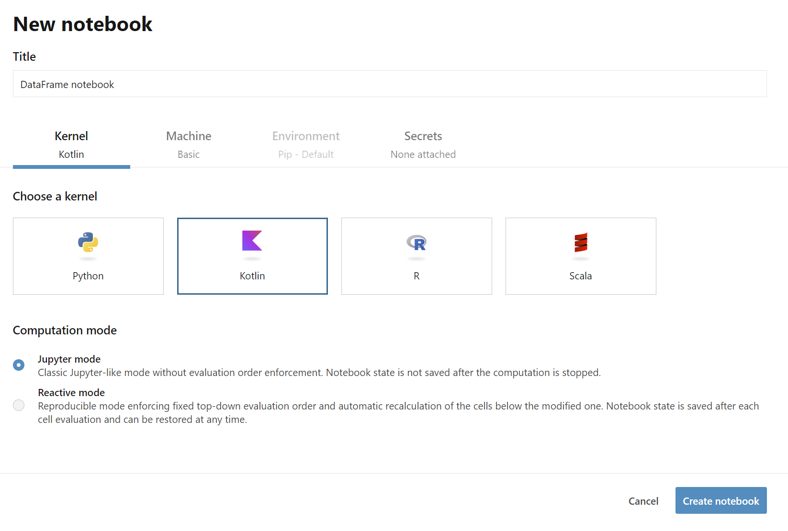
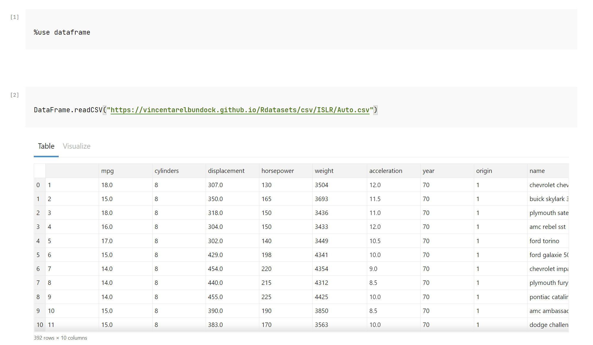

[//]: # (title: Installation)

You can use DataFrame in different environments - as any other JVM library.
The following sections will show how to use DataFrame in [Jupyter](#jupyter-notebook), [Datalore](#datalore) and in a [Gradle project](#gradle).

# Jupyter Notebook

You can use DataFrame in Jupyter Notebook and in Jupyter Lab.
To start, install the latest version of [Kotlin kernel](https://github.com/Kotlin/kotlin-jupyter#installation) and start your favorite Jupyter client from
the command line, for example:

```shell
jupyter notebook
```

In the notebook you only have to write single line to start using dataframe:

```text
%use dataframe
```

In this case the version which is bundled with the kernel, will be used.
If you want to always use the latest version, add another magic before `%use dataframe`:

```text
%useLatestDescriptors
%use dataframe
```

If you want to use specific version of DataFrame, you can specify it in brackets:

```text
%use dataframe(0.9)
```

After loading, all essential types will be already imported, so you can start using DataFrame. Enjoy!

# Datalore

To start with DataFrame in Datalore, create a Kotlin notebook first:



As the Notebook you've created is actually a Jupyter notebook, you can follow the instructions in the [previous section](#jupyter-notebook) to turn DataFrame on. The simplest way of doing this is shown on screenshot:



# Gradle

DataFrame is published to Maven Central, so you can simply add the following line to your Kotlin DSL
buildscript to depend on it:

```kotlin
dependencies {
    implementation("org.jetbrains.kotlinx:dataframe:<version>")
}
```

In Groovy DSL buildscript setup is very similar:
```groovy
dependencies {
    implementation 'org.jetbrains.kotlinx:dataframe:<version>'
}
```

## Gradle plugin configuration

We provide a Gradle plugin that generates interfaces by your data.
To use it in your project, pick up the latest version from [here](https://plugins.gradle.org/plugin/org.jetbrains.kotlin.plugin.dataframe)
and declare plugin dependency in the `plugins` block:
```groovy
plugins {
  id "org.jetbrains.kotlin.plugin.dataframe" version "<version>"
}
```

Note that it's better to use the same version for a library and plugin to avoid unpredictable errors.

# Other build systems

If you are using Maven, Ivy or Bazel to configure your build, you can still use DataFrame in your project.
Just follow the instructions for your build system on [this page](https://search.maven.org/artifact/org.jetbrains.kotlinx/dataframe/0.8.0-dev-515/jar).
